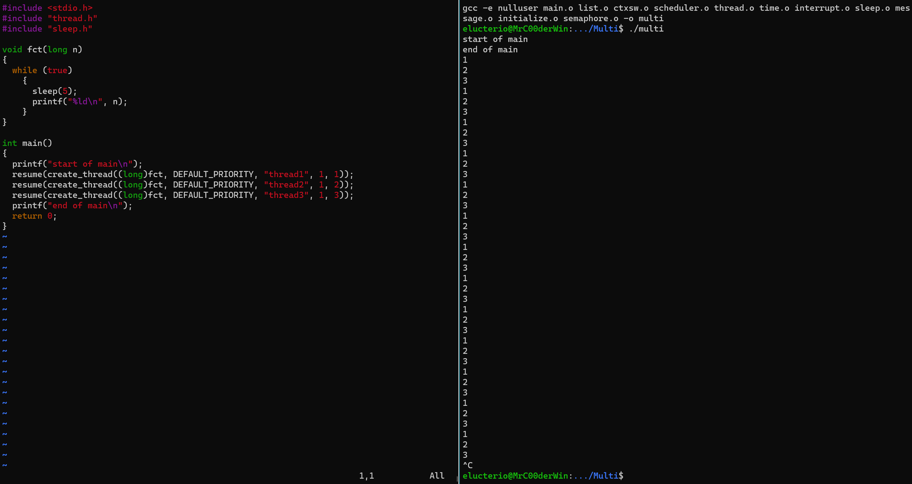

# Light threads library
This is the solution of a light threads library lab inspired by [Xinu](https://xinu.cs.purdue.edu/?msclkid=28f145b9a61b11ecb67a7e9d29fe66bb). 
You can find the lab subjects in the directory `writeup` (`tp1.pdf` and `tp2.pdf` in french).

To compile and run:
```bash
make
./multi
```

